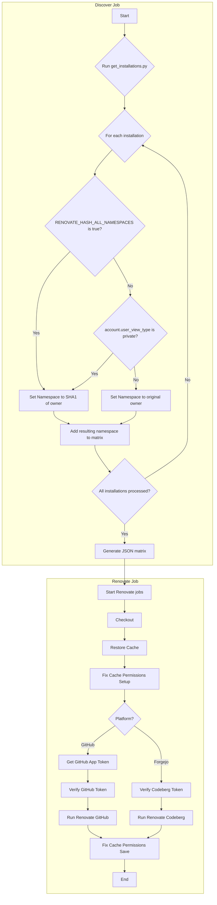

# Self-Hosted Renovate Bot (GitHub & Codeberg)

A GitHub Actions workflow to run a self-hosted Renovate bot instance that manages dependencies for repositories on both **GitHub** and **Codeberg**.

## Purpose

This project provides a template to easily set up and run your own Renovate bot without needing a dedicated server. It leverages GitHub Actions to run the Renovate CLI on a schedule, keeping your dependencies up-to-date across your projects.

## Features

-   **Multi-Platform Support:** Runs Renovate for both GitHub and Codeberg repositories in parallel.
-   **Multi-Tenant GitHub Support:** Manages multiple GitHub organizations or user accounts with a single workflow using matrix.
    -   Each namespace (org/user name) within the matrix will spawn a new job with name `Renovate (github - {namespace})`
    -   Automatically hashes the names of private namespaces in job names. See the [Setup Guide](SETUP.md) for more details.
-   **Serverless:** Runs entirely on GitHub Actions (no VPS required).
-   **Template Ready:** Designed to be used as a GitHub Repository Template.
-   **Secure:** Uses GitHub Apps and Secrets for authentication.
-   **Customizable:** Configurable via GitHub Repository Variables and a shared `renovate-config.js`.

## Getting Started

1.  **Use this Template:** Click the "Use this template" button to create a new repository from this one.
2.  **Configure:** Follow the detailed setup instructions in [SETUP.md](SETUP.md) to configure the necessary GitHub App, Codeberg Bot, and Repository Secrets.
3.  **Run:** The workflow is configured to run on a schedule (e.g., hourly) or manually via `workflow_dispatch`.

## Documentation

For complete installation and configuration instructions, please refer to the **[Setup Guide](SETUP.md)**.

## How It Works

The workflow runs in two stages:
1.  A **`discover`** job fetches all GitHub App installations and generates a dynamic build matrix.
2.  A **`renovate`** job then runs for each installation in parallel, alongside a static job for Codeberg.

This allows the bot to seamlessly manage dependencies across multiple GitHub organizations or user accounts.

## Credits are References:
- [Renovate Github Action Runner](https://github.com/renovatebot/github-action)

## License
[AGPLv3 License](LICENSE)
